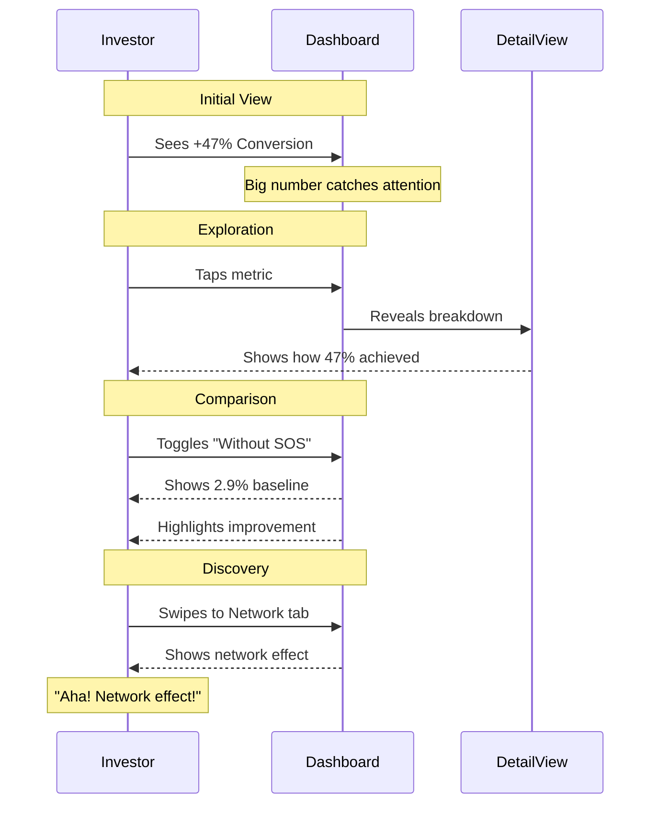

# SOS Dashboard Wireframes - iPad Demo Version
*Optimized for investor demos on iPad mini*

## Design Principles
- **Hybrid Interaction**: Big obvious numbers + explorable details
- **Swipe Between Tabs**: Natural iPad navigation
- **Tap to Explore**: Each metric reveals deeper insights
- **Compare Mode**: Toggle "With/Without SOS" on any screen

## Variant A: Big Numbers Design

```mermaid
graph TB
    subgraph "Tab 1: Friction → Conversion (Hero Screen)"
        A1[Header: Fashion Boutique Demo - Live Dashboard]
        A2[Hero Metric: +47% Conversion Lift - Big Green Arrow Up]
        A3[Secondary: $127,384 Additional Revenue This Month]
        A4[Mini Chart: Conversion Rate Over Time]
        A5[Bottom Cards: Good Actor Experience 98% | Bad Actors Blocked 99.2%]
        A6[Swipe Hint Arrow →]
    end

    subgraph "Tab 2: Network Intelligence"
        B1[Hero Metric: 1.2M Verifications Recycled]
        B2[Secondary: 73% Skip Verification]
        B3[Visual: Network Map Showing Connections]
        B4[Bottom Metric: 2.3 Seconds Average Time Saved]
        B5[Tap for Details: Network Growth Timeline]
    end

    subgraph "Tab 3: Visitor Intelligence"
        C1[Visitor Breakdown: Pie Chart]
        C2[VIP/Trusted: 18% → 55% Conversion]
        C3[New Visitors: 72% → 14% Conversion]
        C4[Blocked/Bots: 10% → 0% Conversion]
        C5[Live Feed: Recent Visitor Decisions]
    end

    subgraph "Tab 4: AI Automation"
        D1[Hero: 14,237 Decisions Today]
        D2[Secondary: 312 Hours Saved This Month]
        D3[Accuracy Meter: 99.7%]
        D4[Cost Savings: $18,420/month vs Manual Review]
        D5[Activity Log: Recent AI Actions]
    end
```

## Variant B: Visual Metaphor Design

```mermaid
graph TB
    subgraph "Tab 1: Friction → Conversion (Visual)"
        E1[Header: Fashion Boutique Demo]
        E2[Speedometer: Conversion Rate - Needle at High/Green Zone]
        E3[Before SOS: 2.9% | With SOS: 4.3%]
        E4[Revenue Thermometer: +$127K Filling Up]
        E5[Traffic Light: 🟢 Good 🟡 Unknown 🔴 Bad]
    end

    subgraph "Tab 2: Network Intelligence (Visual)"
        F1[Network Visualization: Animated Nodes Connecting]
        F2[Recycling Icon: 73% with Circular Animation]
        F3[Time Saved Clock: -2.3 seconds]
        F4[Coverage Map: Heat Map of Protected Stores]
    end

    subgraph "Tab 3: Visitor Intelligence (Visual)"
        G1[Airport Security Lanes Visual]
        G2[Fast Lane: VIP/Trusted → Express]
        G3[Regular Lane: New Visitors → Standard]
        G4[Security Check: Suspicious → Detailed]
        G5[No Entry: Bots/Threats → Blocked]
    end

    subgraph "Tab 4: AI Automation (Visual)"
        H1[Robot Icon: Working/Deciding Animation]
        H2[Conveyor Belt: Processing Visitors]
        H3[Accuracy Target: Bullseye at 99.7%]
        H4[Money Bag: Filling with Savings]
    end
```

## Interaction Patterns



## iPad-Specific Features

### 1. Gesture Hints
```
┌─────────────────────────────────┐
│ ← Swipe between tabs →          │
│                                 │
│    Tap any metric for details ↓ │
└─────────────────────────────────┘
```

### 2. Compare Toggle (Top Right)
```
┌─────────────────────────────────┐
│                    [With SOS ✓] │
│                    [Without   ] │
└─────────────────────────────────┘
```

### 3. Drill-Down Example
```
Tap: "+47% Conversion Lift"
         ↓
┌─────────────────────────────────┐
│ Conversion Breakdown:           │
│                                 │
│ Trusted (18%):  55% conv (+92%) │
│ New (72%):      14% conv (+20%) │
│ Blocked (10%):   0% conv (-100%)│
│                                 │
│ Weighted Avg:   +47%            │
│                 ────             │
│ [Back to Overview]              │
└─────────────────────────────────┘
```

## Demo Flow Script

### Opening (Tab 1 - Show Impact)
"Let me show you something interesting. This fashion boutique increased conversions by 47% - here's their live dashboard."
*[Hand iPad to investor]*

### Discovery Moment (They tap for details)
"Go ahead, tap that number..."
*[They discover the breakdown]*
"Exactly! We're not just blocking bad actors, we're accelerating good ones."

### Network Effect (Swipe to Tab 2)
"Swipe right to see the magic..."
*[Network visualization appears]*
"1.2 million verifications recycled. When one store verifies a customer, every store benefits."

### Scale Story (Tab 4)
"And here's the beautiful part - it's all automated. 14,000 decisions today alone, no human intervention needed."

### Close
"This is just one merchant. Imagine this across thousands of Shopify stores."

## Implementation Notes

1. **Font Sizes**: 
   - Hero metrics: 72pt
   - Secondary: 36pt  
   - Details: 24pt
   - Minimum: 18pt

2. **Colors**:
   - Positive/Growth: #10B981 (Green)
   - Neutral: #6B7280 (Gray)
   - Negative/Blocked: #EF4444 (Red)
   - Interactive: #3B82F6 (Blue)

3. **Animation**:
   - Numbers count up on load
   - Gentle pulse on interactive elements
   - Smooth transitions between views

4. **Loading**: 
   - Instant (pre-loaded demo data)
   - No spinners or delays

5. **Offline Mode**:
   - Full functionality without internet
   - "Demo Mode" indicator subtle but visible